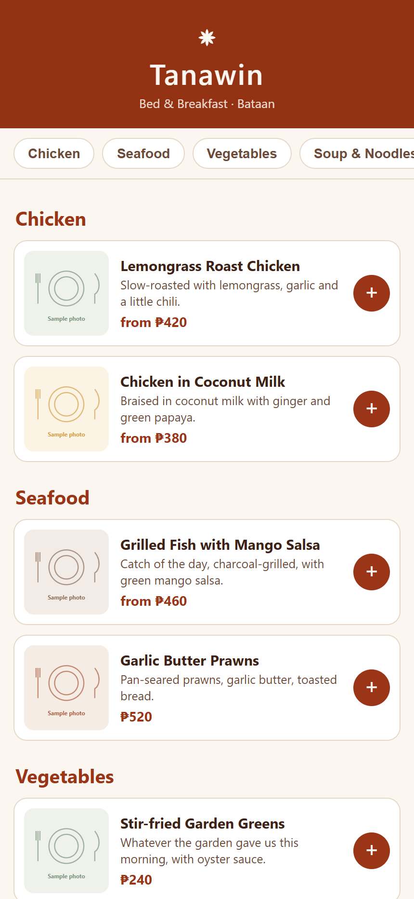
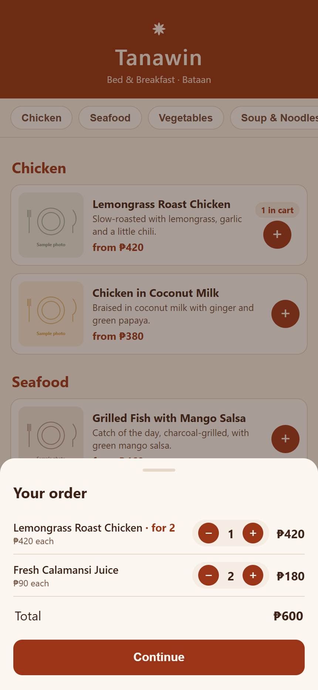
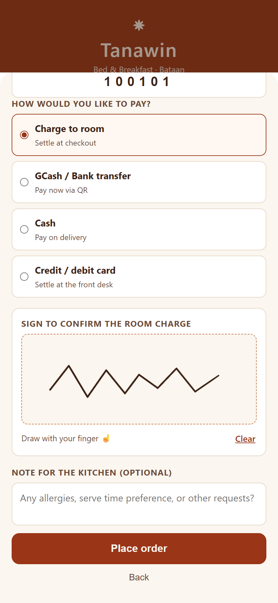
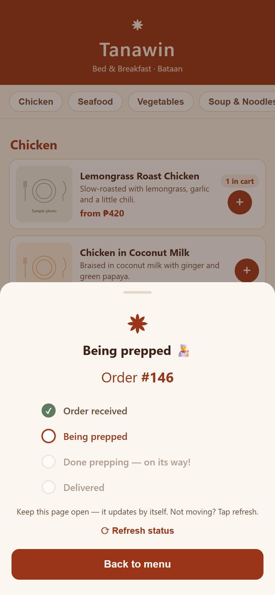
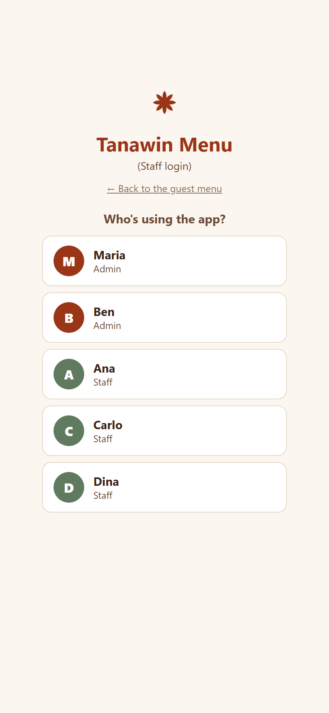
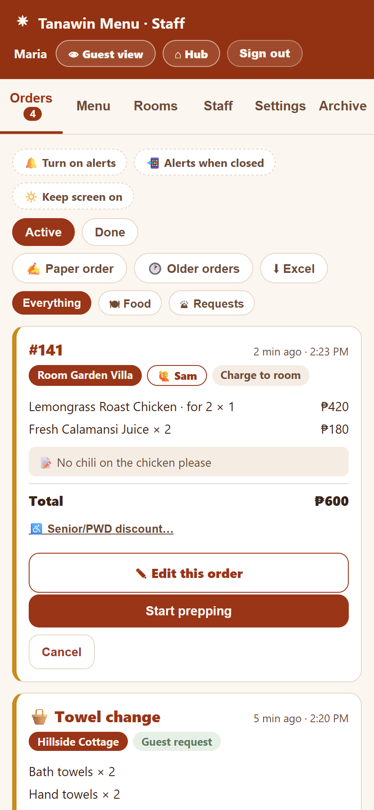
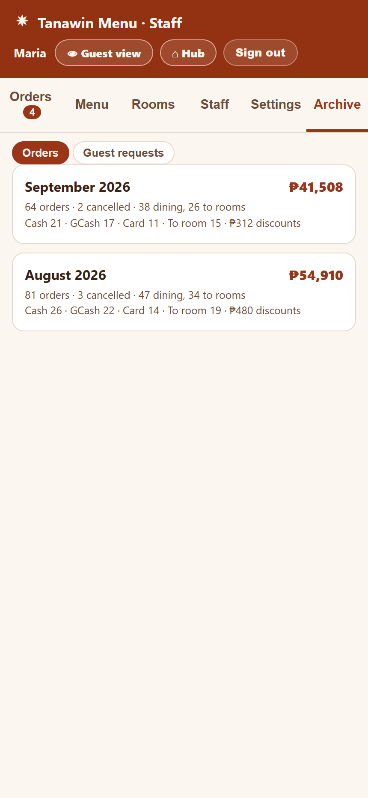
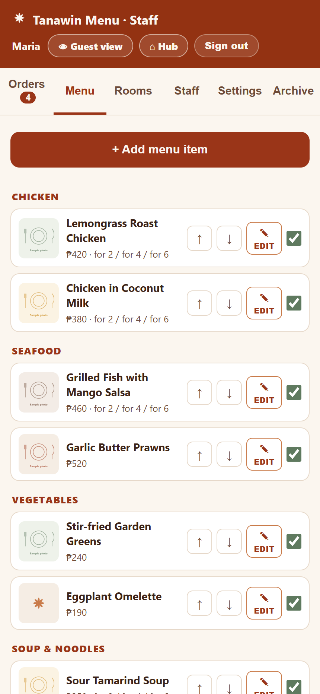

# Tanawin Menu

Customer-facing QR digital menu for **Tanawin Bed & Breakfast** (Sinagtala, Brgy Tala, Orani, Bataan).
One QR code → guest browses the menu on their phone → orders to their room or table.

Part of the Tanawin family: **Finance** (expenses), **Kitchen** (kitchen ops), **Hub** (launcher), **Menu** (this app).

## Screenshots

Everything shown is made-up data. The dishes, prices, staff, rooms, access codes and orders are all invented, and the screens were rendered against an in-memory stand-in for the database rather than the live one. Captured at phone width, which is how guests and staff actually use it.

<table>
  <tr>
    <td align="center"> Guest menu</td>
    <td align="center"> Cart</td>
    <td align="center"> Checkout and signature</td>
    <td align="center"> Live order tracker</td>
  </tr>
  <tr>
    <td align="center"> Staff sign-in</td>
    <td align="center"> Orders and guest requests</td>
    <td align="center"> Monthly archive</td>
    <td align="center"> Menu editor</td>
  </tr>
</table>

## Two surfaces, one codebase

| Surface | File | Who | Auth |
|---|---|---|---|
| Guest menu | `index.html` | Guests (the QR target) | none — anonymous |
| Staff dashboard | `staff.html` | Lexi + staff | 6-digit PIN (consistent with the other Tanawin apps) |

## Stack

- Vanilla HTML/CSS/JS single-page apps — **no build step**. Supabase JS client via CDN.
- Supabase (its own project, `tanawin-menu`, ref `lkeuiquqogtevsgvaddf`): Postgres + Auth + Storage + Realtime + Edge Functions. Unlike Finance, this app **runs DDL and Edge Functions freely**.
- SMS nudge: Supabase Edge Function → **Semaphore** (PH-local). Ships **stubbed** (`sms_enabled=false` in `settings`); flip the toggle in the staff dashboard once the Semaphore account is funded and `SEMAPHORE_API_KEY` is set as a function secret.

## How orders flow

1. Guest adds items to cart, checks out with their **room access code** (given at check-in; walk-in diners get the Dining Area code from staff), a room-service/dining-in choice, payment intent (`room` | `gcash` | `cash`), optional note + GCash proof screenshot, and a touch signature for room charges.
2. `place_order` (security-definer RPC) validates the access code server-side (the code *resolves* the room — clients never name their own room), rate-caps orders per room, validates items, computes the total from **live menu prices** (client totals are never trusted), inserts `orders` + `order_items`, and returns the order number. Codes live in the `rooms` table (no anon read access) and are managed in the staff dashboard's Rooms tab.
3. Staff dashboard receives the order over a realtime subscription — sound + toast — and advances status: `new → preparing → delivered` (or `cancelled`).
4. In parallel, a pg_net trigger POSTs to the `order-sms` Edge Function (shared-secret header), which sends the SMS when enabled.

## Database

Migrations live in `db/` and were applied via the Supabase management API:

- `001_schema.sql` — 4 tables (`menu_items`, `orders`, `order_items`, `settings`), RLS policies (guests: read available items + insert orders only; staff: full management), 2 storage buckets (`menu-images` public, `gcash-proofs` private), realtime publication on `orders`.
- `002_place_order.sql` — the guest ordering RPC.
- `003_order_webhook.sql` — pg_net trigger → `order-sms` function (`__ORDER_WEBHOOK_SECRET__` placeholder is substituted at apply time).

The payment QR shown at checkout is a public asset at `menu-images/gcash-qr.jpg` (replaceable from the staff dashboard's Settings tab) — the `settings` table stays fully staff-only.

## Local dev

Serve the folder statically, e.g. `npx http-server -p 3400 -c-1 .` — there is nothing to build.
Secrets (`.env.local`, `staff-login.txt`) are gitignored and never ship; the anon key in `js/config.js` is public by design.

## Managing the menu

Everything is self-serve in the staff dashboard (`staff.html`): add/edit/delete items, prices, descriptions, availability toggles, per-category reordering, and photo upload/replace/remove (items without a photo show the branded flower placeholder). No code changes needed.
